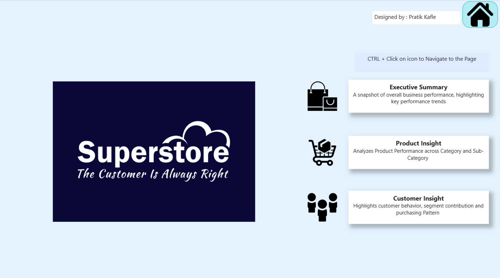
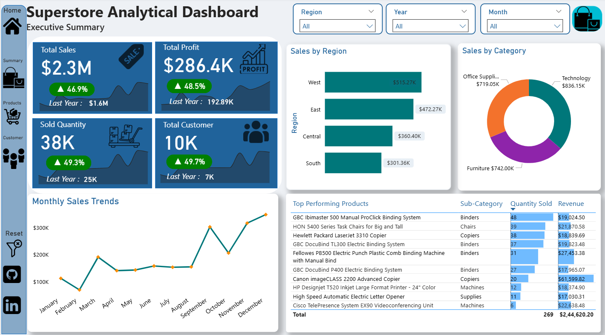
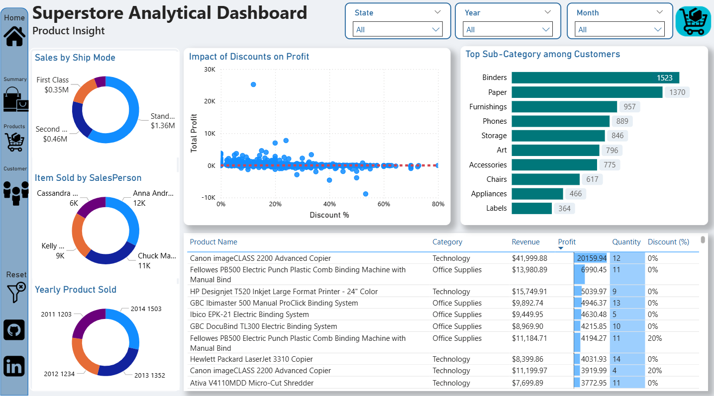
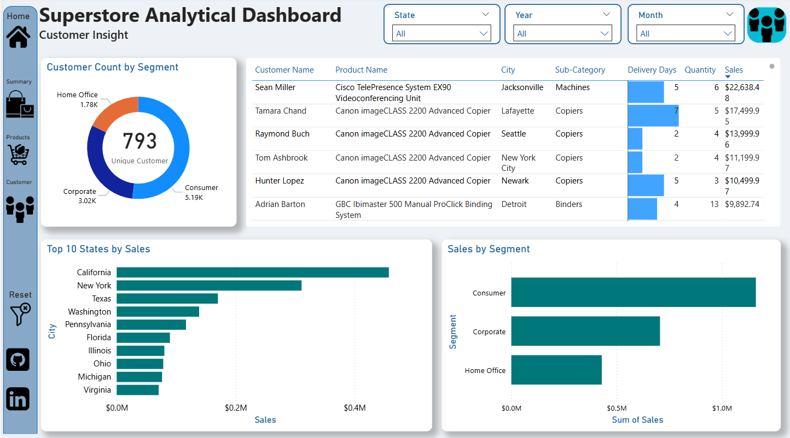

# Superstore Analytical Dashboard – Internship Project

### Introduction
Retail data is full of stories about customers, products, and performance. During my Data Science & Analytics internship at FutureIntern, I built this Power BI dashboard to explore Superstore sales data. The dashboard highlights three perspectives: **Executive Summary**, **Product Insight**, and **Customer Insight**, helping stakeholders quickly understand growth trends, regional performance, and customer behavior.

📁 **Dashboard File:** [Click here to see Dashboard](Superstore_Analytical_Dashboard.pbix)

---

### Skills Showcased
🎨 **Dashboard Design:** Created clean, intuitive layouts that are easy to explore.

⚙️ **Power Query:** Used for cleaning and transforming messy raw data.

🔗 **Data Modeling:** Established a Star Schema for accurate reporting.

🧮 **DAX Measures:** Calculated complex KPIs like YoY growth.

📊 **Visual Analysis:** Used Bar Chart, Tables, Donut Chart and Scatter Plots.

🖱️ **Interactivity:** Implemented Slicers, Buttons, and Bookmarks for navigation.

---

### Insights

#### 📉 Executive Summary
The Executive Summary page gives leaders a quick snapshot of growth and regional performance.

* **Total Sales** reached $2.3M, showing a 46.9% increase from the previous year.
* **Total Profit** improved to $286.4K (up 48.5%), indicating stronger cost management.
* **Regional Trends:** The West ($515K) and East ($472K) regions lead in revenue, while the South region generates the lowest sales ($301K).
* **Top Category:** Technology generates the highest revenue ($836K), outperforming Furniture and Office Supplies.

#### 📦 Product Insight
The Product Insight page highlights profitability and quality trends.

* **The "Discount Trap":** A scatter plot analysis of *Profit vs. Discount* reveals that **products discounted above 40% consistently result in a financial loss**.
* **Shipping Preferences:** Standard Class shipping dominates sales volume ($1.36M), showing that customers prioritize cost over speed.
* **Top Products:** The "Canon imageCLASS 2200 Advanced Copier" is the highest revenue-generating product ($41,999), driving significant profit for the Technology category.

#### 🔍 Customer Insight
The Customer Insight page reveals customer segments and buying behavior.

* **Volume vs. Value:** While "Consumers" make up the largest group by count (5.19K), the **Sales by Segment** analysis shows that the Corporate and Home Office segments are also critical revenue drivers.
* **Top Locations:** **California, New York, and Texas** are the top three states by sales volume. Focusing on these high-revenue geographies is more impactful than targeting lower-volume regions.
* **Customer Value:** Key clients like Sean Miller and Tamara Chand are identified as top contributors, with individual sales exceeding $17K.

---

### 💡 Business Recommendations
Based on the dashboard insights, here are a few recommendations:

1.  **Cap Discounts at 40%:** The scatter plot analysis proves that discounts exceeding 40% destroy profit margins. Implementing a hard cap on sales team discounts could instantly improve bottom-line profitability.
2.  **Focus on "Revenue" States:** Marketing spend should be targeted at California and New York, which historically generate the highest revenue, rather than spreading budget evenly across lower-performing states.
3.  **Optimize Standard Shipping:** Since the majority of sales come via Standard Class ($1.36M), optimizing this specific logistics channel will have the biggest impact on reducing overhead costs.
4.  **Inventory Planning:** Ensure high stock levels for top-performing items like Canon Copiers and Phones, especially in the West and East regions where demand is highest.

---

### 📬 Contact Details
If you’d like to connect, collaborate, or share feedback:

* **Name:** Pratik Kafle
* **Email:** pratikkafle65@gmail.com
* **LinkedIn:** [https://www.linkedin.com/in/pratik-kafle](https://www.linkedin.com/in/pratik-kafle)
* **GitHub:** [https://github.com/Pratik-Kafle](https://github.com/Pratik-Kafle)